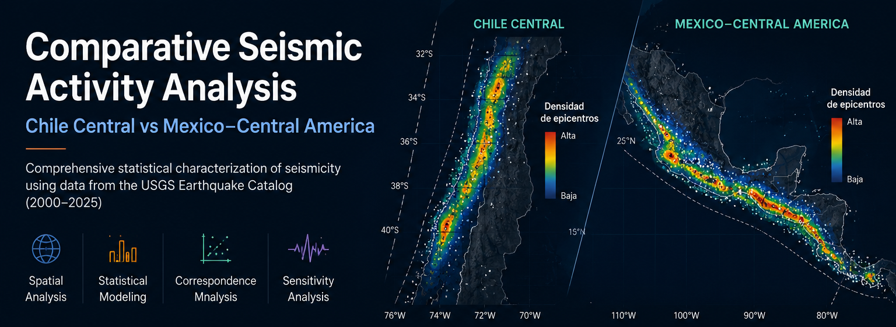

  

**Nota:** La portada corresponde a una composición visual del proyecto. Los resultados estadísticos reproducibles se presentan en las figuras, scripts e informes incluidos en este repositorio.

# Comparative Seismic Activity Analysis

## Chile Central vs. Mexico–Central America

Statistical comparison of seismic activity between **Chile Central** and **Mexico–Central America** using earthquake records from the **USGS Earthquake Catalog (2000–2025)**.

This repository documents the complete workflow developed in **R**, including data preparation, exploratory analysis, spatial characterization, statistical inference and sensitivity analyses.
