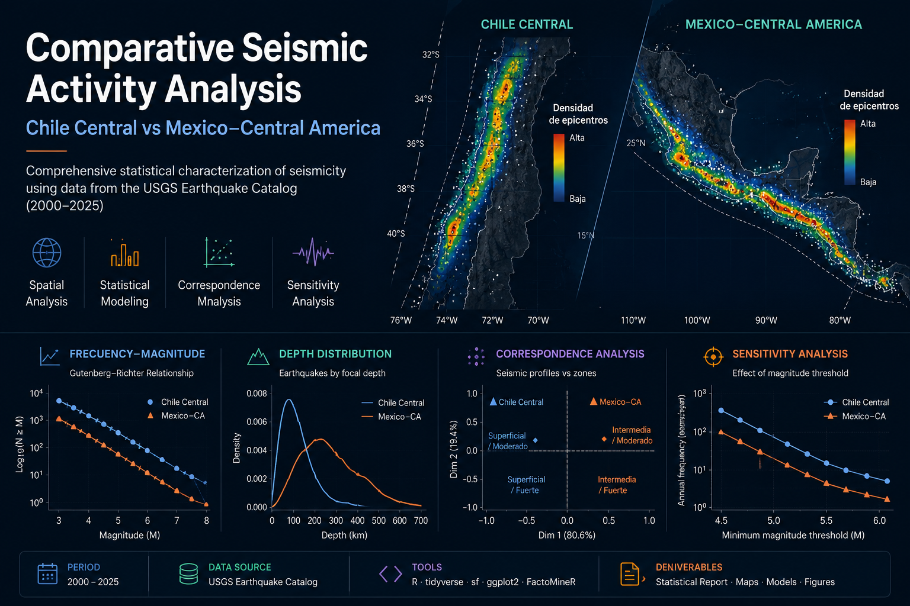

  

**Nota:** La portada corresponde a una composición visual del proyecto. Los resultados estadísticos reproducibles se presentan en las figuras, scripts e informes incluidos en este repositorio.

# Análisis comparativo de la sismicidad  
## Chile Central vs. México–Centroamérica

Comparación estadística de la actividad sísmica registrada entre 2000 y 2025, utilizando datos del **USGS Earthquake Catalog** y herramientas de análisis desarrolladas en **R**.

## Autoría y contribuciones

Este proyecto fue desarrollado en equipo durante la asignatura Taller I de Ingeniería Estadística de la Universidad de Santiago de Chile.

**Integrantes:**
- Camila Herrera
- Benjamín Jamett
- Sofía Roca

**Contribución principal personal:**
- Comparaciones no paramétricas de magnitud y profundidad.
- Análisis de correspondencia.
- Análisis de sensibilidad frente al umbral de magnitud y delimitación espacial.
- Interpretación estadística de resultados.
- Elaboración de tablas, figuras y documentación en LaTeX.
- Revisión de código y coherencia entre resultados e informe.

La versión publicada en este repositorio fue reorganizada y documentada con fines de portafolio académico.
